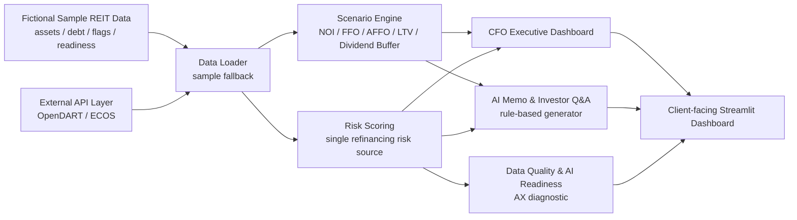

# K-REIT CFO Copilot

**K-REIT CFO Copilot: rule-based AX decision support prototype for listed REIT CFOs, AMCs, IR teams, and risk management teams.**

현재 버전: **v08.1**  
Release type: **pre-submission stabilization hotfix**

## Disclaimer

본 프로젝트의 회사명, 티커, 재무 수치, Risk Score, 공시 관련 문구는 모두 포트폴리오 목적의 fictional sample data이며, 실제 특정 기업의 재무 상태나 공시 내용과 무관합니다. 현재 버전은 rule-based 로직으로 동작하며 생성형 AI/LLM을 사용하지 않습니다.

## 프로젝트 개요

K-REIT CFO Copilot은 상장 REIT CFO, AMC, IR팀이 금리, 차입, 자산가치, 세금, 배당, 공시 품질, Data Quality 리스크를 하나의 Dashboard에서 진단하고, Scenario Engine 결과를 CFO briefing memo와 Investor Q&A draft로 전환하는 Streamlit 기반 AX prototype입니다.

현재 앱은 세 개의 fictional sample REIT를 중심으로 동작합니다.

- Alpha Prime REIT / `999901.KS` / `reit_a`
- Beta Retail REIT / `999902.KS` / `reit_b`
- Gamma Logistics REIT / `999903.KS` / `reit_c`

v08부터 OpenDART와 ECOS API를 연결하는 external API data layer를 추가했지만, API key가 없거나 응답이 비어 있어도 sample data fallback으로 안정적으로 실행됩니다.

## 왜 AX Prototype인가

이 앱은 회계 담당자를 위한 내부 자동화 도구가 아닙니다. 전표 처리, 결산 보조, 단순 리포트 생성을 목표로 하지 않고, 상장 REIT 고객의 경영 의사결정과 대외 커뮤니케이션을 지원하는 client-facing consulting prototype입니다.

- **Decision support**: refinancing, dividend, asset, disclosure, AI Readiness 중 CFO attention이 필요한 영역을 우선순위화합니다.
- **Scenario thinking**: 금리, 임대료, 자산가치, 세금효과 변화가 FFO, AFFO, LTV, dividend buffer에 미치는 영향을 투명하게 보여줍니다.
- **Rule-based narrative conversion**: 숫자와 Risk Score를 CFO Memo 및 Investor Q&A 초안으로 전환합니다.
- **AX readiness diagnostic**: AI 적용 전 Data Quality, KPI standardization, Scenario Capability, Tax-Finance Integration 수준을 진단합니다.

## 고객 Pain Point

상장 REIT의 의사결정 데이터는 DART 공시, IR 자료, 차입 일정표, 자산관리 파일, 세무 검토, Excel 모델에 분산되어 있습니다. 그 결과 CFO, AMC, IR팀은 같은 숫자를 보더라도 서로 다른 리스크 해석과 메시지를 만들기 쉽습니다.

- 금리 상승과 차입 만기 집중이 dividend sustainability에 미치는 영향을 빠르게 설명하기 어렵습니다.
- asset-level NOI, WALE, tenant concentration, capex risk가 CFO Dashboard와 IR narrative로 연결되지 않습니다.
- Scenario 분석 결과가 CFO briefing memo나 Investor Q&A 초안으로 자연스럽게 전환되지 않습니다.
- Data Quality와 KPI 정의가 정리되지 않으면 AI Memo와 disclosure workflow를 신뢰하기 어렵습니다.

## Target Users

- **CFO**: refinancing, dividend, asset, disclosure, AI Readiness 중 오늘 가장 먼저 확인할 리스크와 권고 액션을 판단합니다.
- **AMC**: asset-level performance와 risk를 투자자에게 설명 가능한 narrative로 정리합니다.
- **IR팀**: 금리, 배당, 자산가치, 공시 품질 관련 예상 질문에 대해 일관된 Investor Q&A 초안을 준비합니다.
- **Risk Management팀**: debt maturity wall, LTV, floating-rate exposure, Data Quality flags를 모니터링합니다.

## Solution Architecture



```text
k-reit-cfo-copilot/
  app.py
  data/                 fictional sample REIT data
  modules/
    api_clients/        OpenDART / ECOS clients and API key config
    data_loader.py      API-first, sample-fallback data loading
    scenario_engine.py  scenario calculations and refinancing risk source
    risk_scoring.py     Risk Score and AI Readiness logic
    memo_generator.py   rule-based memo and Investor Q&A generation
  pages/                six Streamlit dashboard pages
  tests/                regression tests
```

## v08 External API Data Layer

v08는 sample data 기반 MVP에서 real external data 기반 prototype으로 이동하기 위한 첫 단계입니다.

- **OpenDART integration purpose**: 공시 목록, disclosure signal, 회사 식별 정보를 가져오기 위한 API client를 추가했습니다.
- **ECOS integration purpose**: Scenario Engine의 market interest rate assumption을 ECOS 금리 데이터로 보강합니다.
- **KRX roadmap**: 상장 REIT 가격, 거래량, market data는 future roadmap으로 유지합니다.
- **API key management**: API key는 Streamlit secrets를 먼저 확인하고, 없으면 `.env`에서 읽습니다. 코드에는 API key를 hardcode하지 않습니다.
- **Fallback design**: API key가 없거나 API 응답이 실패/공백이면 sample data로 fallback하여 앱이 중단되지 않습니다.

## v08.1 Hotfix

v08.1은 신규 기능 확장이 아니라 제출 전 안정화 hotfix입니다.

- Refinancing Risk Score 계산을 `scenario_engine.run_scenario()`로 단일화했습니다.
- 실제 REIT 이름과 티커를 fictional sample data로 교체했습니다.
- README와 Streamlit sidebar에 sample data 및 rule-based prototype disclaimer를 추가했습니다.
- README의 AI 관련 표현을 rule-based AX prototype 중심으로 정리했습니다.
- regression tests를 추가했습니다.

## 6개 Dashboard 구성

1. **고객 Pain Point**  
   CFO, AMC, IR팀의 실제 pain point를 business risk와 Copilot response로 연결합니다.

2. **CFO Executive Dashboard**  
   Overall Risk Score, category별 Risk Score, Top 3 CFO Alerts로 CFO attention allocation을 지원합니다.

3. **Scenario Engine**  
   ECOS 또는 sample market rate를 base interest rate로 사용하고, 금리 충격, 임대료 변화율, 자산가치 변화율, 세금효과 반영 여부를 조정해 FFO, AFFO, LTV, dividend buffer, refinancing risk level을 계산합니다.

4. **자산 및 차입 리스크**  
   asset risk ranking, debt maturity wall, floating-rate exposure, LTV, disclosure quality flags를 함께 보여줍니다.

5. **AI Memo & Investor Q&A**  
   현재 버전은 외부 LLM API를 사용하지 않고, scenario 및 risk input을 rule-based logic으로 변환해 CFO Briefing Memo와 Investor Q&A draft를 생성합니다.

6. **데이터 품질 및 AI Readiness**  
   External Data Connection 상태, Missing data, Inconsistent values, Unusual movement, Manual review required를 진단하고 weighted AI Readiness Score와 improvement roadmap을 제공합니다.

## Business Impact

- CFO가 quantitative output을 board memo language로 빠르게 전환할 수 있습니다.
- AMC가 asset risk와 scenario 결과를 투자자 설명 가능한 narrative로 연결할 수 있습니다.
- IR팀이 반복되는 Investor Q&A에 대해 데이터 기반의 일관된 답변 초안을 만들 수 있습니다.
- AX 도입 전 필요한 Data Quality, KPI 표준화, process maturity 개선 과제를 명확히 할 수 있습니다.
- 외부 API data layer를 통해 데이터 최신성, 반복 업무 감소, scenario 신뢰성 개선 방향을 보여줍니다.

## Known Limitations

- 현재 데이터는 3개 fictional sample REIT 기반이며 실제 기업 데이터가 아닙니다.
- Pain Point와 Risk Score는 실제 고객 인터뷰로 검증된 수치가 아니라 AX prototype 설계를 위한 가정입니다.
- 모든 Risk Score / AI Readiness Score 가중치는 데모용 가정이며, 실제 client delivery 단계에서는 client data와 인터뷰를 통해 calibration이 필요합니다.
- 현재 Memo Generator는 rule-based이며 생성형 AI/LLM을 사용하지 않습니다.
- 세금효과 계산은 단순화된 가정이며 실제 세무자문 또는 valuation model이 아닙니다.
- API 연결은 external data layer 구조를 보여주기 위한 단계이며, 모든 REIT metric이 완전 자동화된 것은 아닙니다.

## Tech Stack

- `streamlit`: client-facing Dashboard UI
- `pandas`: mock/API data loading and transformation
- `numpy`: scenario calculation, Risk Score, weighted scoring
- `plotly`: executive chart, scenario chart, maturity wall, AI readiness chart
- `requests`: OpenDART / ECOS API client
- `python-dotenv`: local `.env` API key loading
- `pytest`: regression tests

## Version History

- **v08.1**: pre-submission hotfix, fictional sample data, refinancing risk score unification, disclaimer, known limitations, regression tests
- **v08**: OpenDART / ECOS external API data layer, API key config, sample fallback, ECOS market rate Scenario Engine 연동
- **v07**: Samil PwC AX Node 포트폴리오 제출용 README 구조 정리, Mermaid architecture diagram 추가, AX prototype positioning 강화
- **v06**: Data Quality & AI Readiness를 AX consulting diagnostic module로 강화
- **v05**: rule-based CFO Memo & Investor Q&A narrative generator 강화
- **v04**: CFO Executive Dashboard를 attention allocation tool로 고도화
- **v03**: Scenario Engine을 CFO-level decision support module로 확장
- **v02**: Korean-first portfolio release
- **v01**: initial Streamlit MVP

## Future Roadmap

- 실제 **OpenDART / ECOS / KRX API** coverage 확대
- **KRX** 상장 REIT 가격, 거래량, market cap data 연동
- **Figma prototype** 기반 UX 설계 고도화
- **Power BI dashboard** 연동 또는 executive reporting layer 확장
- **Power Automate workflow** 기반 memo review 및 approval process 연결
- **OpenAI API-based memo generation** 및 retrieval-augmented Investor Q&A 고도화
- role-based Dashboard: CFO, AMC, IR, Risk Management별 view 분리

## Run Locally

```bash
pip install -r requirements.txt
streamlit run app.py
```

Optional local API key setup:

```bash
OPENDART_API_KEY=your_opendart_key
ECOS_API_KEY=your_ecos_key
```

## Tests

```bash
pytest
```
