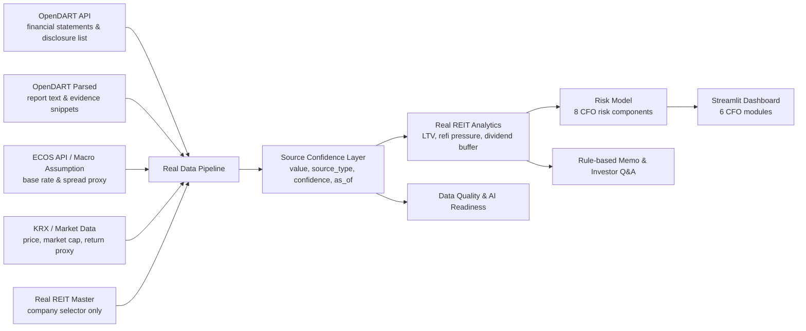

# K-REIT CFO Copilot

현재 버전: **v12**

**K-REIT CFO Copilot**은 상장 REIT CFO, AMC, IR팀이 금리, 차입, 자산, 세금, 배당, 공시 품질 리스크를 하나의 Dashboard에서 진단하고, 시나리오 분석 결과를 CFO 보고 메모와 Investor Q&A로 전환하는 **client-facing AX prototype**입니다.

이 프로젝트는 회계 담당자용 내부 자동화 도구가 아닙니다. 고객사의 의사결정, management narrative, 투자자 커뮤니케이션, Data Quality, AI Readiness를 연결하는 **K-REIT CFO decision intelligence platform**을 목표로 합니다.

## 프로젝트 개요

- Real API Mode를 기본 흐름으로 두고 OpenDART, ECOS, market/public data, 공시 parser, macro assumption을 source-tagged metrics로 통합합니다.
- Demo / Sample Mode는 end-to-end 데모용 fictional sample data입니다.
- Real API Mode에서는 sample values를 실제 상장 REIT financials로 사용하지 않습니다.
- API key가 없거나 API 응답이 비어도 앱은 중단되지 않으며, 해당 metric은 `Not Available` 또는 `Fallback Assumption`으로 표시됩니다.

## 고객 Pain Point

상장 REIT CFO, AMC, IR팀은 DART 공시, IR 자료, treasury 파일, 세무 검토, 내부 Excel이 분산되어 있어 다음 문제가 반복됩니다.

- refinancing risk와 금리 민감도 판단이 늦어짐
- FFO, AFFO, LTV, WALE 등 핵심 KPI 기준이 문서마다 다름
- 배당가능성과 차입 만기 구조를 투자자에게 일관되게 설명하기 어려움
- 공시 품질과 Data Quality가 AI 도입 전제조건으로 관리되지 않음
- 시나리오 분석 결과가 CFO memo, board summary, Investor Q&A로 자연스럽게 전환되지 않음

## Target Users

- Listed REIT CFO
- AMC 재무/운용/리스크 담당자
- IR팀 및 투자자 커뮤니케이션 담당자
- Risk management team
- AX consulting / transformation team

## Solution Architecture



## 6개 Dashboard 구성

1. **고객 Pain Point**: CFO, AMC, IR팀의 customer problem과 business impact를 정리합니다.
2. **CFO Executive Dashboard**: Overall Risk Score, component risk, Top CFO Alerts, scenario migration, peer availability를 보여주는 attention allocation 화면입니다.
3. **Scenario Engine**: Base Case, Rate +50bp, Rate +100bp, Credit Spread +50bp, Combined Stress, Downside Macro, Upside Macro가 dividend buffer와 refinancing pressure에 미치는 영향을 계산합니다.
4. **자산 및 차입 리스크**: debt composition, maturity wall, interest sensitivity, 공시 원문 evidence snippet을 분리합니다.
5. **AI Memo & Investor Q&A**: rule-based CFO briefing memo, board-level risk summary, Investor Q&A draft를 생성합니다. 외부 LLM API는 사용하지 않습니다.
6. **데이터 품질 및 AI Readiness**: source inventory, parser status, collected metrics, missing metrics, confidence distribution, manual validation 항목을 보여줍니다.

## v12 API-First Real REIT CFO Intelligence Upgrade

v12는 Real API Mode를 중심으로 CFO-grade decision intelligence에 가까워지도록 구조를 확장했습니다.

- `modules/source_confidence.py`: 모든 real metric에 `value`, `unit`, `source`, `source_type`, `confidence`, `as_of`, `calculation_method`, `warning` schema를 적용합니다.
- `modules/account_mapper.py`: OpenDART 계정명을 Korean/English alias로 매핑해 total assets, liabilities, cash, debt, revenue, operating income, interest expense 등을 추출합니다.
- `modules/opendart_client.py`: OpenDART disclosure / financial statement layer를 분리했습니다.
- `modules/opendart_parser.py`: 공시 원문 parser entry point와 evidence snippet 구조를 마련했습니다.
- `modules/market_data_client.py`: KRX/public market data 수집 wrapper를 분리했습니다.
- `modules/real_reit_analytics.py`: Real REIT metrics, scenario, peer comparison availability, source inventory, collected metrics를 하나의 dashboard model로 구성합니다.
- `modules/real_reit_risk_model.py`: Leverage, Liquidity, Interest Rate, Refinancing, Dividend Sustainability, Market Signal, Disclosure Freshness, Data Quality 8개 component를 계산합니다.

현재 모든 real REIT metric이 완전히 자동화된 것은 아닙니다. FFO, AFFO, WALE, 임차인 집중도, 자산별 NOI, 세금효과, 정확한 차입 만기 구조는 OpenDART 원문 parser 개선과 고객 내부자료 validation이 필요합니다.

## Business Impact

- CFO가 오늘 확인해야 할 refinancing, liquidity, dividend, disclosure 리스크를 우선순위화합니다.
- Scenario Engine 결과를 board memo와 Investor Q&A 초안으로 연결합니다.
- Real API Mode에서 API-sourced data, parsed data, fallback assumption, manual validation 필요 항목을 명확히 구분합니다.
- AX consulting 관점에서 “AI를 붙이기 전 데이터 기반이 준비되어 있는가”를 진단합니다.

## Tech Stack

- Python
- Streamlit
- pandas
- numpy
- plotly
- requests
- OpenDART API client
- ECOS API client
- rule-based memo generation

## 실행 방법

```bash
pip install -r requirements.txt
python -m streamlit run app.py
```

API key는 hardcoding하지 않습니다. Streamlit secrets 또는 `.env`를 사용합니다.

```text
DART_API_KEY=...
ECOS_API_KEY=...
```

API key가 없어도 앱은 실행되며, Real API Mode financials는 `Not Available`로 표시됩니다.

## Version History

- **v12**: API-first Real REIT CFO Intelligence upgrade, source confidence schema, account mapper, OpenDART/parser/market wrappers, Real REIT analytics model, 8-component risk model, Real Mode Dashboard/Scenario/Asset/Data Quality upgrade
- **v11.1**: automated real data collection layer, OpenDART financial statement extraction fallback, source/confidence-tagged metrics
- **v11**: Real API Mode analysis parity, Korean money formatter, indexed navigation, simplified Real Mode UI
- **v10.1**: Korean UI copy and encoding hotfix
- **v10**: responsible Real API Insight Layer, Data Availability Matrix, manual real scenario bridge

## Future Roadmap

- 실제 OpenDART report parser 정확도 개선 및 재무제표 계정 매핑 고도화
- ECOS treasury/corporate bond series mapping 확대
- KRX API 또는 안정적인 market data source 연동
- KAREIT / Company IR data 수집 안정화
- FFO/AFFO, WALE, tenant concentration, asset-level NOI validation workflow
- Figma prototype
- Power BI dashboard
- Power Automate workflow
- OpenAI API-based memo generation

