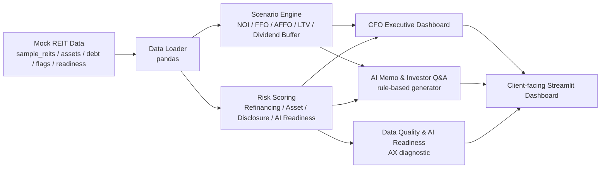

# K-REIT CFO Copilot

**K-REIT CFO Copilot: AI-powered decision intelligence for listed REIT CFOs, AMCs, and IR teams.**

현재 버전: **v07**  
Portfolio positioning: **Samil PwC AX Node 제출용 client-facing AX prototype**

## 프로젝트 개요

K-REIT CFO Copilot은 상장 Korean REIT CFO, AMC, IR팀이 금리, 차입, 자산가치, 세금, 배당, 공시 품질, Data Quality 리스크를 하나의 Dashboard에서 진단하고, Scenario Engine 결과를 CFO briefing memo와 Investor Q&A draft로 전환하는 Streamlit 기반 AX prototype입니다.

현재 버전은 mock/sample data를 사용하는 MVP입니다. 실제 DART, ECOS, KRX API 연동이나 외부 LLM API 기반 memo generation은 아직 구현하지 않았으며, future roadmap에 포함되어 있습니다.

## 포트폴리오 제출 Positioning

이 프로젝트는 “AI로 무엇을 자동화할 것인가”보다 “고객의 어떤 의사결정 문제를 AX로 해결할 것인가”에 초점을 둔 포트폴리오입니다. CFO가 오늘 먼저 봐야 할 리스크를 좁혀주고, 정량 분석 결과를 경영진 보고와 투자자 커뮤니케이션으로 연결하는 decision intelligence workflow를 보여줍니다.

## 왜 AX Prototype인가

이 앱은 회계 담당자를 위한 내부 자동화 도구가 아닙니다. 전표 처리, 결산 보조, 단순 리포트 생성보다 상장 REIT 고객의 경영 의사결정과 대외 커뮤니케이션을 지원하는 client-facing consulting prototype입니다.

- **Decision support**: refinancing, dividend, asset, disclosure, AI Readiness 중 CFO attention이 필요한 영역을 우선순위화합니다.
- **Scenario thinking**: 금리, 임대료, 자산가치, 세금효과 변화가 FFO, AFFO, LTV, dividend buffer에 미치는 영향을 단순하고 투명하게 보여줍니다.
- **Narrative conversion**: 숫자와 Risk Score를 CFO Memo 및 Investor Q&A 초안으로 전환합니다.
- **AX readiness diagnostic**: AI 적용 전 Data Quality, KPI standardization, Scenario Capability, Tax-Finance Integration 수준을 진단합니다.

## 고객 Pain Point

상장 REIT의 의사결정 데이터는 DART 공시, IR 자료, 차입 일정표, 자산관리 파일, 세무 검토, Excel 모델에 분산되어 있습니다. 그 결과 CFO, AMC, IR팀은 같은 숫자를 보더라도 서로 다른 리스크 해석과 메시지를 만들기 쉽습니다.

- 금리 상승과 차입 만기 집중이 dividend sustainability에 미치는 영향을 빠르게 설명하기 어렵습니다.
- asset-level NOI, WALE, tenant concentration, capex risk가 CFO Dashboard와 IR narrative로 연결되지 않습니다.
- Scenario 분석 결과가 CFO briefing memo나 Investor Q&A 초안으로 자연스럽게 전환되지 않습니다.
- Data Quality와 KPI 정의가 정리되지 않으면 AI Memo와 disclosure workflow를 신뢰하기 어렵습니다.

## Target Users

- **CFO**: refinancing, dividend, asset, disclosure, AI Readiness 중 오늘 가장 먼저 확인할 리스크와 권고 액션을 판단합니다.
- **AMC**: asset-level performance와 risk를 투자자에게 설명 가능한 narrative로 정리합니다.
- **IR팀**: 금리, 배당, 자산가치, 공시 품질 관련 예상 질문에 대해 일관된 Investor Q&A 초안을 준비합니다.
- **Risk Management팀**: debt maturity wall, LTV, floating-rate exposure, Data Quality flags를 모니터링합니다.

## Solution Architecture



```text
k-reit-cfo-copilot/
  app.py
  data/       mock/sample Korean REIT data
  modules/    reusable data, scenario, risk, memo, UI functions
  pages/      six Streamlit dashboard pages
```

## 6개 Dashboard 구성

1. **고객 Pain Point**  
   CFO, AMC, IR팀의 실제 pain point를 business risk와 Copilot response로 연결합니다.

2. **CFO Executive Dashboard**  
   Overall Risk Score, category별 Risk Score, Top 3 CFO Alerts로 CFO attention allocation을 지원합니다.

3. **Scenario Engine**  
   금리 충격, 임대료 변화율, 자산가치 변화율, 세금효과 반영 여부를 조정해 Scenario-adjusted NOI, FFO, AFFO, LTV, dividend buffer, refinancing risk level을 계산합니다.

4. **자산 및 차입 리스크**  
   asset risk ranking, debt maturity wall, floating-rate exposure, LTV, disclosure quality flags를 함께 보여줍니다.

5. **AI Memo & Investor Q&A**  
   scenario 및 risk input을 rule-based logic으로 변환해 CFO Briefing Memo와 Investor Q&A draft를 생성합니다.

6. **데이터 품질 및 AI Readiness**  
   Missing data, Inconsistent values, Unusual movement, Manual review required를 진단하고, weighted AI Readiness Score와 improvement roadmap을 제공합니다.

## Business Impact

- CFO가 quantitative output을 board memo language로 빠르게 전환할 수 있습니다.
- AMC가 asset risk와 scenario 결과를 투자자 설명 가능한 narrative로 연결할 수 있습니다.
- IR팀이 반복되는 Investor Q&A에 대해 데이터 기반의 일관된 답변 초안을 만들 수 있습니다.
- AX 도입 전 필요한 Data Quality, KPI 표준화, process maturity 개선 과제를 명확히 할 수 있습니다.

## Tech Stack

- `streamlit`: client-facing Dashboard UI
- `pandas`: mock REIT data loading and transformation
- `numpy`: scenario calculation, Risk Score, weighted scoring
- `plotly`: executive chart, scenario chart, maturity wall, AI readiness chart

## Version History

- **v07**: Samil PwC AX Node 포트폴리오 제출용 README 구조 정리, Mermaid architecture diagram 추가, AX prototype positioning 강화
- **v06**: Data Quality & AI Readiness를 AX consulting diagnostic module로 강화
- **v05**: rule-based CFO Memo & Investor Q&A narrative generator 강화
- **v04**: CFO Executive Dashboard를 attention allocation tool로 고도화
- **v03**: Scenario Engine을 CFO-level decision support module로 확장
- **v02**: Korean-first portfolio release
- **v01**: initial Streamlit MVP

## Future Roadmap

현재 MVP는 sample data 기반입니다. 실제 client delivery 수준으로 확장하려면 다음 기능이 필요합니다.

- 실제 **DART / ECOS / KRX API** 연동
- **Figma prototype** 기반 UX 설계 고도화
- **Power BI dashboard** 연동 또는 executive reporting layer 확장
- **Power Automate workflow** 기반 memo review 및 approval process 연결
- **OpenAI API-based memo generation** 및 retrieval-augmented Investor Q&A 고도화
- role-based Dashboard: CFO, AMC, IR, Risk Management별 view 분리

## Run Locally

```bash
pip install -r requirements.txt
streamlit run app.py
```
