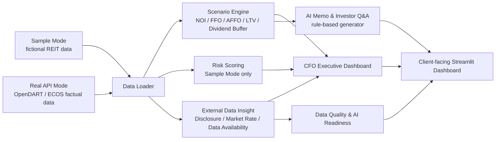

# K-REIT CFO Copilot

**K-REIT CFO Copilot: AI-powered decision intelligence prototype for listed Korean REIT CFOs, AMCs, IR teams, and risk management teams.**

현재 버전: **v10.1**

Release type: **Korean UI copy and encoding hotfix**

## 프로젝트 개요

K-REIT CFO Copilot은 상장 REIT CFO, AMC, IR팀이 금리, 차입, 자산, 세금, 배당, 공시 품질 리스크를 하나의 Dashboard에서 진단하고, Scenario Engine 결과를 CFO 보고 메모와 Investor Q&A 초안으로 전환하는 client-facing AX prototype입니다.

이 프로젝트는 회계 담당자를 위한 내부 자동화 도구가 아닙니다. 고객 경영진이 “어디에 먼저 attention을 배분해야 하는가”, “시나리오 변화가 배당가능성과 리파이낸싱 압력에 어떤 영향을 주는가”, “투자자 커뮤니케이션에서 어떤 메시지를 준비해야 하는가”를 판단하도록 돕는 consulting-style decision support platform입니다.

## Disclaimer

Sample Mode의 회사명, 수치, Risk Score, 공시 신호, AI Readiness 결과는 모두 fictional sample data입니다. 실제 기업의 재무상태, 공시 품질, 투자위험 또는 신용판단을 나타내지 않습니다.

Real API Mode는 OpenDART·ECOS 등 공개 API로 조회 가능한 사실 정보와 사용자가 직접 입력한 가정만을 기반으로 합니다. 본 화면은 실제 기업에 대한 투자 의견, 신용 판단, 부정적 리스크 평가를 제공하지 않습니다. 실제 투자, 공시, 재무 의사결정에는 원문 공시, 내부 재무자료, 전문가 검토가 필요합니다.

현재 버전은 rule-based prototype이며 외부 LLM API를 사용하지 않습니다.

## 고객 Pain Point

상장 REIT의 의사결정 데이터는 DART 공시, IR 자료, 차입 일정표, 자산관리 파일, 세무 검토, Excel 모델에 분산되어 있습니다. CFO, AMC, IR팀은 같은 숫자를 보더라도 서로 다른 리스크 메시지를 만들기 쉽고, 금리 변화나 자산가치 변화가 배당가능성과 refinancing pressure에 미치는 영향을 빠르게 설명하기 어렵습니다.

K-REIT CFO Copilot은 다음 질문에 답하도록 설계되었습니다.

- 금리, 임대료, 자산가치, 세금효과 변화가 FFO, AFFO, LTV, dividend buffer에 어떤 영향을 주는가?
- CFO가 오늘 가장 먼저 확인해야 할 리스크는 무엇인가?
- OpenDART와 ECOS에서 확인 가능한 factual data와 내부 확인이 필요한 manual data를 어떻게 구분할 것인가?
- 분석 결과를 CFO Memo와 Investor Q&A draft로 어떻게 전환할 것인가?
- AX 도입을 위해 Data Quality와 process maturity가 어느 정도 준비되어 있는가?

## Target Users

- **CFO**: refinancing, dividend, asset, disclosure, AI Readiness 중 우선 확인 영역을 판단합니다.
- **AMC**: asset-level performance와 scenario 결과를 경영진 및 투자자 설명 언어로 전환합니다.
- **IR팀**: 금리, 배당, 자산가치, 공시 관련 예상 질문과 답변 초안을 준비합니다.
- **Risk Management팀**: debt maturity wall, LTV, floating-rate exposure, Data Quality flags를 모니터링합니다.

## Solution Architecture



```text
k-reit-cfo-copilot/
  app.py
  data/                 sample data and real REIT master list
  modules/
    api_clients/        OpenDART / ECOS clients and API key config
    data_loader.py      sample data loader and v08 compatibility wrappers
    real_data_loader.py Real API Mode data loading with fallback behavior
    real_insights.py    v10 factual insight and manual scenario logic
    scenario_engine.py  sample scenario calculations
    risk_scoring.py     sample Risk Score and AI Readiness logic
    memo_generator.py   rule-based CFO Memo and Investor Q&A
  pages/                six Streamlit dashboard pages
  tests/                regression tests
```

## 6개 Dashboard 구성

1. **고객 Pain Point**  
   CFO, AMC, IR팀의 pain point를 business risk와 Copilot response로 연결합니다.

2. **CFO Executive Dashboard**  
   Sample Mode에서는 Overall Risk Score, category별 Risk Score, Top 3 CFO Alerts를 보여줍니다. Real API Mode에서는 OpenDART/ECOS factual data와 사용자 입력 scenario만 표시합니다.

3. **Scenario Engine**  
   Sample Mode에서는 금리 충격, 임대료 변화율, 자산가치 변화율, 세금효과를 기반으로 NOI, FFO, AFFO, LTV, dividend buffer, refinancing risk level을 계산합니다. Real API Mode에서는 사용자가 직접 입력한 총자산, 차입금, NOI, 배당금, 변동금리 비중 등을 기반으로 hypothetical output을 표시합니다.

4. **자산 및 차입 리스크**  
   Sample Mode에서는 asset risk ranking, debt maturity wall, floating-rate exposure, disclosure quality flags를 보여줍니다. Real API Mode에서는 검증되지 않은 회사별 risk 판단 대신 공시 조회와 시장금리 factual insight를 제공합니다.

5. **AI Memo & Investor Q&A**  
   Sample Mode에서는 rule-based CFO Briefing Memo와 Investor Q&A draft를 생성합니다. Real API Mode에서는 자동 생성 판단을 제한하고 원문 공시 확인과 내부 데이터 검증 필요성을 안내합니다.

6. **데이터 품질 및 AI Readiness**  
   Sample Mode에서는 Data Quality Flags와 weighted AI Readiness Score를 진단합니다. Real API Mode에서는 External Data Connection과 Data Availability Matrix를 통해 API 자동화 가능 영역과 manual validation 필요 영역을 구분합니다.

## v10 Real API Insight Layer

v10은 Real API Mode를 책임 있는 real-data insight layer로 강화했습니다. 목표는 “실제 회사명에 fictional Risk Score나 부정적 판단을 붙이지 않으면서, 공개 API로 확인 가능한 factual data와 사용자 입력 가정 기반의 scenario bridge를 제공하는 것”입니다.

- **OpenDART Disclosure Monitor**: 최근 공시, 공시명, 접수일, 보고서 유형, 접수번호, 원문 링크, 정기공시 여부, freshness indicator를 표시합니다.
- **ECOS Market Rate Panel**: 최신 시장금리, 기준일, 최근 추세, 데이터 출처 상태, rate shock scenario basis를 표시합니다.
- **Manual Scenario Bridge**: 총자산, 총차입금, NOI, 배당금, 변동금리 비중, 평균 coupon, 단기 만기 비중, 금리 충격, 임대료 변화, 자산가치 변화, 세금효과 입력을 받아 LTV, interest expense, dividend buffer, refinancing pressure를 계산합니다.
- **Responsible Interpretation**: CFO interpretation은 사실 정보와 사용자 입력 가정만 설명하며, 투자 의견, 신용 판단, 부정적 Risk Score를 생성하지 않습니다.
- **Fallback Design**: API key가 없거나 API 응답이 비어도 sample/default data로 앱이 중단되지 않도록 설계했습니다.

## Data Availability Matrix

| Metric | Source | API availability | Automation level | Manual validation required? | Notes |
|---|---|---|---|---|---|
| 회사명 / ticker | Real REIT master CSV | Available internally | Semi-automated | Yes | corp_code 매핑 검증 필요 |
| OpenDART 공시 목록 | OpenDART API | Available with API key | Automated | Yes | 공시 원문 확인 필요 |
| 최근 정기공시 | OpenDART API | Available with API key | Automated factual check | Yes | 사업보고서, 반기보고서, 분기보고서 여부 |
| 기준금리 / 시장금리 | ECOS API | Available with API key | Automated | No | Scenario Engine의 market rate basis |
| 주가 / 시가총액 | KRX | Roadmap | Not automated yet | Yes | v10 범위 제외 |
| FFO / AFFO | 공시 주석 / 내부 모델 | Not directly automated | Manual input | Yes | REIT별 정의 차이 검증 필요 |
| WALE | IR 자료 / 내부 asset file | Not directly automated | Manual input | Yes | 임대차 계약 데이터 필요 |
| 임차인 집중도 | 내부 asset file | Not available via current API | Manual input | Yes | tenant-level data 필요 |
| 자산별 NOI | 내부 asset file | Not available via current API | Manual input | Yes | asset-level management data 필요 |
| 차입 만기 구조 | 공시 주석 / 내부 treasury file | Partially available | Manual validation | Yes | maturity schedule 정규화 필요 |
| 세금효과 | 세무 검토 / 내부 tax model | Not automated | Manual input | Yes | 실제 세무 자문 필요 |
| Investor Q&A | Scenario / risk output | Sample Mode rule-based | Draft only | Yes | Real Mode에서는 자동 판단 제한 |

## Business Impact

- CFO가 quantitative output을 board memo language로 빠르게 전환할 수 있습니다.
- AMC가 asset risk와 scenario result를 투자자 설명 가능한 narrative로 연결할 수 있습니다.
- IR팀이 반복되는 Investor Q&A에 대해 데이터 기반 답변 초안을 준비할 수 있습니다.
- AX 도입 전 Data Quality, KPI Standardization, Scenario Capability, Tax-Finance Integration 개선 과제를 식별할 수 있습니다.
- Real API Mode는 OpenDART/ECOS 연결 가능성과 수동 검증 필요 영역을 분리해 responsible automation roadmap을 제시합니다.

## Tech Stack

- `streamlit`: client-facing Dashboard UI
- `pandas`: sample/API data loading and transformation
- `numpy`: scenario calculation, Risk Score, weighted scoring
- `plotly`: executive chart, scenario chart, maturity wall, AI readiness chart
- `requests`: OpenDART / ECOS API client
- `python-dotenv`: local `.env` API key loading
- `pytest`: regression tests

## Version History

- **v10.1**: Korean UI copy and encoding hotfix, Real API Mode disclaimer, ECOS 금리 데이터, CFO 해석 메모, Data Availability Matrix 문구 정리
- **v10**: responsible Real API Insight Layer, OpenDART Disclosure Monitor 강화, ECOS Market Rate Panel 강화, manual real scenario bridge, Data Availability Matrix
- **v09**: Real API Mode, Data Mode selector, OpenDART/ECOS factual data branch, real REIT master list
- **v08.1**: pre-submission stabilization hotfix, fictional sample data, disclaimer, regression tests
- **v08**: OpenDART / ECOS external API data layer, API key config, sample fallback
- **v07**: Samil PwC AX Node portfolio README polish and Mermaid architecture diagram
- **v06**: Data Quality & AI Readiness AX diagnostic
- **v05**: rule-based CFO Memo & Investor Q&A narrative generator
- **v04**: CFO Executive Dashboard attention allocation
- **v03**: Scenario Engine CFO-level decision support
- **v02**: Korean-first portfolio release
- **v01**: initial Streamlit MVP

## Future Roadmap

- OpenDART corp_code 자동 매핑 및 공시 원문 파싱 고도화
- ECOS 기준금리, 국고채, 회사채 spread 등 market rate assumption library 확장
- KRX 상장 REIT 가격, 거래량, market cap data 연동
- Figma prototype 기반 UX 고도화
- Power BI dashboard 또는 executive reporting layer 확장
- Power Automate workflow 기반 memo review, approval, owner tracking
- OpenAI API-based memo generation 및 retrieval-augmented Investor Q&A
- CFO, AMC, IR, Risk Management별 role-based Dashboard 분리

## Run Locally

```bash
pip install -r requirements.txt
streamlit run app.py
```

Optional local API key setup:

```bash
OPENDART_API_KEY=your_opendart_key
ECOS_API_KEY=your_ecos_key
```

## Tests

```bash
pytest
```
