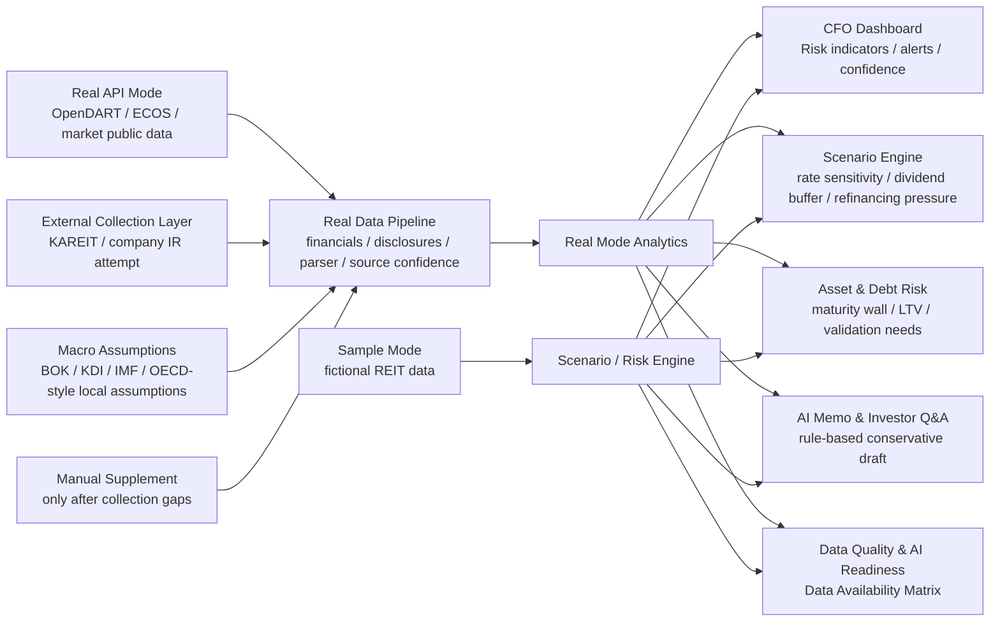

# K-REIT CFO Copilot

**K-REIT CFO Copilot: AI-powered decision intelligence prototype for listed Korean REIT CFOs, AMCs, IR teams, and risk management teams.**

현재 버전: **v11.1**

Release type: **Automated Real Data Collection Layer**

## 프로젝트 개요

K-REIT CFO Copilot은 상장 REIT CFO, AMC, IR팀이 금리, 차입, 자산, 세금, 배당, 공시 품질 리스크를 하나의 Dashboard에서 진단하고, Scenario Engine 결과를 CFO 보고 메모와 Investor Q&A 초안으로 전환하는 client-facing AX prototype입니다.

이 프로젝트는 회계 담당자를 위한 내부 자동화 도구가 아닙니다. 고객 경영진이 “어디에 먼저 attention을 배분해야 하는가”, “금리와 spread 변화가 refinancing pressure와 dividend buffer에 어떤 영향을 주는가”, “투자자 커뮤니케이션에서 어떤 메시지를 준비해야 하는가”를 판단하도록 돕는 consulting-style decision support platform입니다.

## Disclaimer

Sample Mode의 회사명, 수치, Risk Score, 공시 신호, AI Readiness 결과는 모두 fictional sample data입니다. 실제 기업의 재무상태, 공시 품질, 투자위험 또는 신용판단을 나타내지 않습니다.

Real API Mode는 OpenDART·ECOS 등 공개 API로 조회 가능한 사실 정보, 공시 parser 기반 예비 추정, market/public data, macro proxy, 사용자가 직접 보완한 값을 구분해 표시합니다. 실제 기업에 대한 투자 의견, 신용 판단, 부정적 리스크 평가를 제공하지 않으며, 자동 수집과 parser를 먼저 시도한 뒤에도 부족한 항목만 “자동 수집 시도 후 미확보” 또는 “manual validation 필요”로 표시합니다.

현재 버전은 rule-based prototype이며 외부 LLM API를 사용하지 않습니다.

## 고객 Pain Point

- DART 공시, IR 자료, 차입 일정표, 자산관리 파일, 세무 검토, Excel 모델이 분산되어 CFO가 빠르게 의사결정하기 어렵습니다.
- 금리와 credit spread 변화가 배당가능성과 refinancing pressure에 미치는 영향을 즉시 설명하기 어렵습니다.
- FFO, AFFO, LTV, WALE, 차입 만기 구조, 임차인 집중도 등 핵심 KPI의 source-of-truth가 분리되어 있습니다.
- 분석 결과를 CFO Memo와 Investor Q&A draft로 전환하는 데 시간이 많이 걸립니다.
- AI/AX 도입 전 Data Quality와 manual validation 필요 영역을 진단해야 합니다.

## Target Users

- **CFO**: refinancing, dividend, asset, disclosure, AI Readiness 중 우선 확인 영역을 판단합니다.
- **AMC**: asset-level performance와 scenario 결과를 경영진 및 투자자 설명 언어로 전환합니다.
- **IR팀**: 금리, 배당, 자산가치, 공시 관련 예상 질문과 답변 초안을 준비합니다.
- **Risk Management팀**: debt maturity wall, LTV, floating-rate exposure, Data Quality flags를 모니터링합니다.

## Solution Architecture



```text
k-reit-cfo-copilot/
  app.py
  data/
    sample_*.csv              fictional Sample Mode data
    real_reit_master.csv      Real API Mode REIT selector master
    macro_assumptions.csv     BOK/KDI/IMF/OECD-style local assumptions
    cache/                    local cache metadata for external data attempts
  modules/
    api_clients/              OpenDART / ECOS clients and API key config
    macro_assumptions.py      base rate, spread, refinancing scenario assumptions
    real_data_pipeline.py     OpenDART financials, report parser, market/macro data bundle
    real_mode_analytics.py    Real API Mode risk indicators, alerts, scenarios, confidence
    real_mode_components.py   Real API Mode UI components
    reit_external_scrapers.py KAREIT / company IR public data collection helpers
    scenario_engine.py        Sample Mode scenario calculations
    risk_scoring.py           Sample Mode Risk Score and AI Readiness logic
    memo_generator.py         rule-based CFO Memo and Investor Q&A
  pages/                      six Streamlit dashboard pages
  tests/                      regression tests
```

## 6개 Dashboard 구성

1. **고객 Pain Point**: CFO, AMC, IR팀의 pain point를 business risk와 Copilot response로 연결합니다.
2. **CFO Executive Dashboard**: Sample Mode는 Overall Risk Score와 Top CFO Alerts를, Real API Mode는 근거 기반 risk indicators, 산출 제한 여부, data confidence를 표시합니다.
3. **Scenario Engine**: ECOS actual rate, macro assumption, credit/refinancing spread, 사용자 입력 가정을 연결해 Base / Downside / Upside scenario를 보여줍니다.
4. **자산 및 차입 리스크**: debt maturity wall, LTV, interest expense sensitivity, refinancing pressure, manual validation 필요 항목을 구분합니다.
5. **AI Memo & Investor Q&A**: 정량 output을 CFO Memo와 Investor Q&A draft로 전환하되, Real Mode에서는 근거와 한계를 명시합니다.
6. **데이터 품질 · AI Readiness**: Data Availability Matrix, API/fallback status, manual validation need, confidence level을 진단합니다.

## v11.1 Automated Real Data Collection Layer

- Real API Mode가 manual-input-first 방식으로 보이지 않도록, OpenDART 재무제표 API, OpenDART 공시 목록, 공시 원문 parser, ECOS macro data, KRX/public market data, KAREIT/리츠협회 및 company IR 자료 수집 시도를 하나의 `real_data_bundle`로 통합했습니다.
- 모든 metric은 `value`, `unit`, `source`, `confidence`, `as_of`, `note`를 포함합니다. 사용할 수 없는 항목은 sample 값을 빌리지 않고 `value=None`과 “자동 수집 시도 후 미확보”로 남깁니다.
- OpenDART account mapper는 `자산총계`, `부채총계`, `자본총계`, `영업수익`, `현금및현금성자산`, `차입금`, `사채`, `금융비용` 등 가능한 계정명을 CFO-useful metric으로 매핑합니다.
- 공시 원문 parser는 FFO, AFFO, WALE, 임차인 집중도, 자산별 NOI, 배당, 차입, 만기, 이자율 관련 keyword와 근거 snippet을 수집합니다. 구조화 추출이 제한적인 경우에는 Low confidence와 manual validation 권장으로 표시합니다.
- KRX/public market data는 `pykrx`가 설치된 경우 우선 사용하고, 실패하면 public market data fallback을 시도합니다. 시가총액이 없으면 임의 추정하지 않습니다.
- ECOS와 local macro assumption을 결합해 기준금리, treasury yield proxy, corporate bond yield proxy, credit spread proxy, refinancing rate assumption, Base/Downside/Upside rate scenarios를 구성합니다.
- Real API Risk Score는 leverage, liquidity, interest burden, refinancing/maturity, dividend buffer, macro rate pressure, disclosure freshness, market signal 중 최소 4개 category가 산출될 때만 계산합니다.
- 차입 만기 구조는 원문 표가 없더라도 단기차입금 또는 유동부채 기반 proxy를 먼저 표시하고, 약정별 maturity는 manual validation 대상으로 분리합니다.
- Data Quality page는 source status, parser warnings, missing metrics, evidence snippets, fallback assumptions를 확인하는 기술 진단 화면 역할을 합니다.

## v11 Real API Mode Analysis Parity & UI Simplification

- 금액 표기를 `조 / 억 / 만 원` 단위로 통일했습니다. 사용자-facing UI에서는 `bn`, `billion`, `KRW bn`을 사용하지 않습니다.
- Sidebar와 module labels에 `0. App`부터 `6. 데이터 품질 · AI Readiness`까지 일관된 번호를 적용했습니다.
- Real REIT selector를 Data Mode 바로 아래로 이동하고 회사명만 표시합니다. ticker와 corp_code는 기본 화면에서 숨기고, 필요한 경우 접힌 “개발자용 식별 정보”에서만 확인합니다.
- ECOS 화면은 `기준금리`, `최근 기준일`, `최근 방향성`, `Scenario 기준금리`로 단순화했습니다.
- `modules/macro_assumptions.py`와 `data/macro_assumptions.csv`를 추가해 BOK/ECOS actual rate, KDI/IMF/OECD-style outlook assumption, credit spread proxy, refinancing spread assumption을 관리합니다.
- `modules/real_mode_analytics.py`를 추가해 Real API Mode에서도 risk indicators, CFO alerts, debt maturity wall, scenario output, data confidence report를 제공합니다.
- 실제 REIT별 FFO, AFFO, WALE, 임차인 집중도, 자산별 NOI, 차입 만기 구조가 자동 수집과 parser로 확인되지 않으면 값을 만들지 않고 “자동 수집 시도 후 미확보” 또는 “manual validation 필요”로 표시합니다.
- Real API Mode는 raw API status보다 CFO-useful insight, scenario impact, confidence level, validation need를 우선 표시합니다.

## Metric Source Policy

| Metric | Real API Mode 처리 방식 |
|---|---|
| 회사명 | real REIT master 기반 |
| OpenDART 공시 목록 / 최근 정기공시 | API-sourced real data, API key 없으면 fallback status |
| 기준금리 / 시장금리 | ECOS actual data 우선, 없으면 local macro assumption |
| credit spread / refinancing spread | market proxy 또는 수동 관리 가정 |
| 총자산 / 총차입금 / 영업수익 / 이자비용 | OpenDART 재무제표 API 우선, 없으면 미확보 |
| NOI / 배당금 | 공시 parser 및 재무제표 proxy 우선, 없으면 사용자 보완 또는 manual validation |
| FFO / AFFO / WALE / 임차인 집중도 / 자산별 NOI | 공시 원문 parser 우선, 구조화 실패 시 manual validation 필요 |
| 차입 만기 구조 | OpenDART 재무제표와 공시 parser 우선, 단기차입금/유동부채 proxy 가능, 약정별 만기는 manual validation |
| 세금효과 | 별도 세무 검토 필요 |
| Investor Q&A | rule-based draft, 실제 회사 판단 아님 |

## Business Impact

- CFO가 quantitative output을 board memo language로 빠르게 전환할 수 있습니다.
- AMC가 asset risk와 scenario result를 투자자 설명 가능한 narrative로 연결할 수 있습니다.
- IR팀이 반복되는 Investor Q&A에 대해 데이터 기반 답변 초안을 준비할 수 있습니다.
- AX 도입 전 Data Quality, KPI Standardization, Scenario Capability, Tax-Finance Integration 개선 과제를 식별할 수 있습니다.
- Real API Mode는 “자동화 가능 데이터”와 “manual validation 필요 데이터”를 분리해 responsible automation roadmap을 제시합니다.

## Tech Stack

- `streamlit`: client-facing Dashboard UI
- `pandas`: sample/API/assumption data loading and transformation
- `numpy`: scenario calculation, Risk Score, weighted scoring
- `plotly`: executive chart, scenario chart, maturity wall, AI readiness chart
- `requests`: OpenDART / ECOS API client
- `python-dotenv`: local `.env` API key loading
- `pytest`: regression tests

## Version History

- **v11.1**: Automated Real Data Pipeline, OpenDART financial statement extraction, OpenDART report parser, KRX/public market data attempt, KAREIT/company IR scraper layer, ECOS credit spread proxy, source/confidence-tagged metrics, Real API Risk Score with minimum data threshold, debt maturity wall proxy
- **v11**: Real API Mode analysis parity, Korean money formatter, indexed navigation, Real REIT selector relocation, ticker/corp_code hiding, simplified ECOS summary, macro assumption layer, real-mode risk indicators and alerts
- **v10.1**: Korean UI copy and encoding hotfix
- **v10**: responsible Real API Insight Layer, OpenDART Disclosure Monitor 강화, ECOS Market Rate Panel 강화, manual real scenario bridge, Data Availability Matrix
- **v09**: Real API Mode, Data Mode selector, OpenDART/ECOS factual data branch, real REIT master list
- **v08.1**: pre-submission stabilization hotfix, fictional sample data, disclaimer, regression tests
- **v08**: OpenDART / ECOS external API data layer, API key config, sample fallback
- **v07**: Samil PwC AX Node portfolio README polish and Mermaid architecture diagram
- **v06**: Data Quality & AI Readiness AX diagnostic
- **v05**: rule-based CFO Memo & Investor Q&A narrative generator
- **v04**: CFO Executive Dashboard attention allocation
- **v03**: Scenario Engine CFO-level decision support
- **v02**: Korean-first portfolio release
- **v01**: initial Streamlit MVP

## Future Roadmap

- OpenDART corp_code 자동 매핑 및 공시 원문 parser 고도화
- KRX 공식 API 또는 안정적인 market data provider 연동 고도화
- 실제 공시 주석과 내부 treasury file을 결합한 debt maturity normalization
- FFO, AFFO, WALE, tenant concentration 수동 입력 template 정교화
- Figma prototype 기반 UX 고도화
- Power BI dashboard 또는 executive reporting layer 확장
- Power Automate workflow 기반 memo review, approval, owner tracking
- OpenAI API-based memo generation 및 retrieval-augmented Investor Q&A

## Run Locally

```bash
pip install -r requirements.txt
streamlit run app.py
```

Optional local API key setup:

```bash
OPENDART_API_KEY=your_opendart_key
ECOS_API_KEY=your_ecos_key
```

## Tests

```bash
pytest
```
